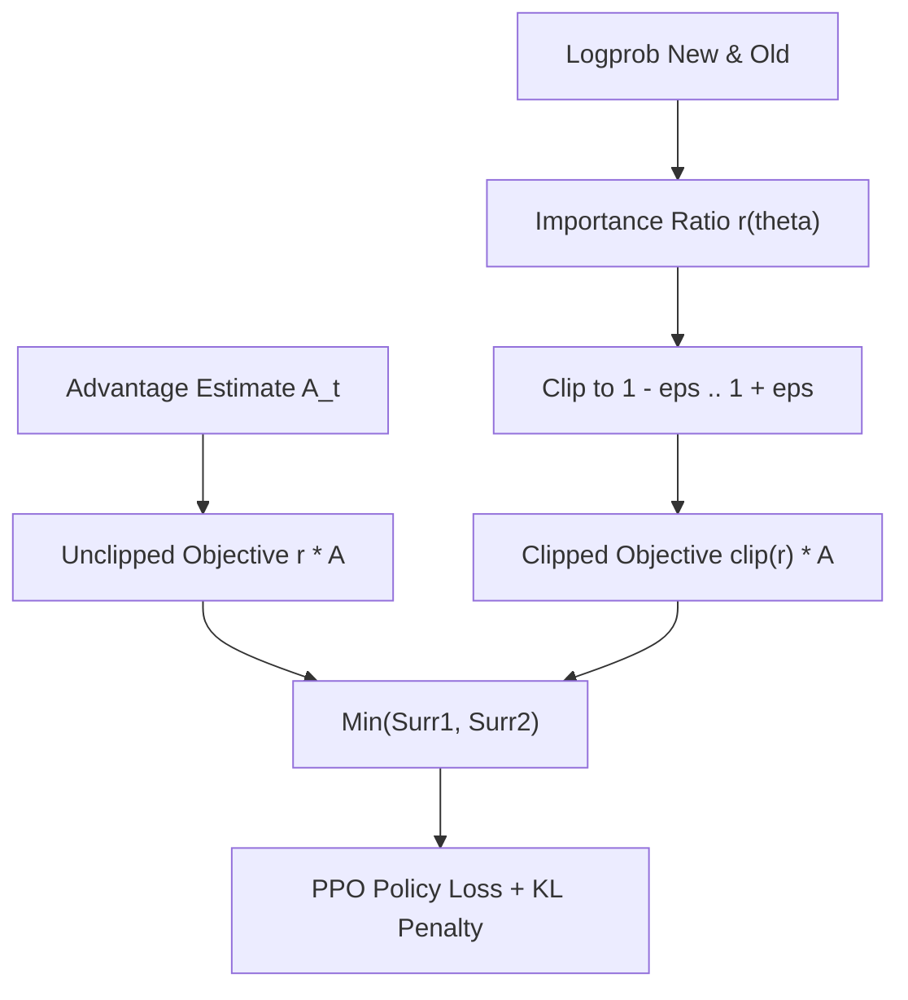

# genpark-ppo-clipped-surrogate-loss-evaluator-skill

Proximal Policy Optimization (PPO) clipped surrogate loss calculator enforcing trust-region policy updates and KL penalty terms.

## Architecture

## Features
- **Clipping Detection**: Flags when updates exceed trust region threshold.
- **Pure Python**: 100% standard library.
